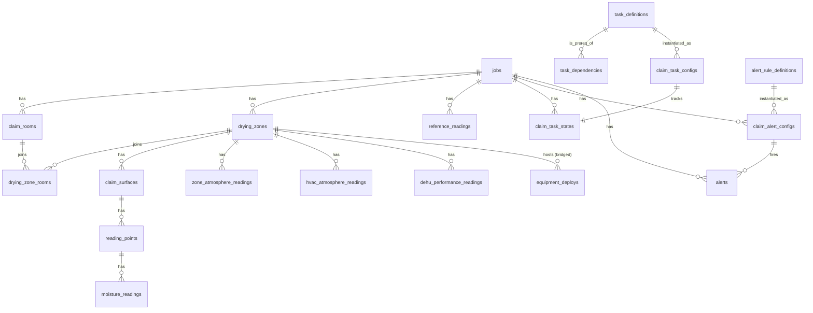

# F18.0 — DryLog PRO Developer Spec (Locked)

> **Phase:** F18.0 — Foundation
>
> **Status:** Naming, schema, and engine interfaces locked. No code yet. Subsequent phases (F18.1+) implement against this spec.
>
> **Companion:** [F18-drylog-rebuild-plan.md](./F18-drylog-rebuild-plan.md) — the phase-level roadmap. This file is the implementation-level reference.
>
> **Date:** 2026-05-24
>
> **Authority:** When the plan doc and this spec disagree, **this spec wins** — it's the contract subsequent phases code against.

---

## 1. Vocabulary (locked)

UI/database/internal-doc names. Carrier-edition PDF uses IICRC industry terms separately (see §10).

| Concept | Locked name | Database identifier |
|---|---|---|
| Product / system | **DryLog PRO** | `drylog_pro_*` (patches, libs, flags) |
| The dry-out job's master record | **Claim** | `jobs` (existing table) |
| A physical room in the claim, persistent across visits | **Room** | `claim_rooms` |
| Logical drying volume (may span rooms or be a portion of one) | **Drying Zone** | `drying_zones` |
| A trackable material face inside a zone (wall, floor, ceiling, baseboard, etc.) | **Surface** | `claim_surfaces` |
| A specific moisture-meter location on a surface | **Reading Point** | `reading_points` |
| One moisture measurement at one point on one visit | **Moisture Reading** | `moisture_readings` |
| Drying target value for a surface | **Dry Goal** | `claim_surfaces.dry_goal` |
| Outdoor / unaffected baseline atmosphere capture | **Baseline Atmosphere** | `reference_readings` |
| Inside-the-zone atmosphere capture | **Zone Atmosphere** | `zone_atmosphere_readings` |
| HVAC supply/return atmosphere capture | **HVAC Atmosphere** | `hvac_atmosphere_readings` |
| Dehumidifier intake + exhaust + runtime capture | **Dehu Performance Reading** | `dehu_performance_readings` |

**Banned legacy phrases (will be removed from UI as F18.7/F18.8 land):** "Hydro", "Drying Chamber", "Moisture Point", "Material" (when meaning surface), "Affected Area Reading", "Unaffected Area Reading", "Dehu Reading" (without "Performance").

---

## 2. Entity Model

### 2.1 ER Diagram



### 2.2 Plain hierarchy

```
Claim (jobs.id)
 └── Room (claim_rooms)                            — persistent across visits
      └── (M:N via drying_zone_rooms)
           └── Drying Zone (drying_zones)          — equipment + atmosphere attach here
                ├── Surface (claim_surfaces)       — wall N, floor, ceiling, baseboard, etc.
                │    └── Reading Point (reading_points)
                │         └── Moisture Reading (moisture_readings)   — per visit
                ├── Zone Atmosphere Reading (zone_atmosphere_readings) — per visit
                ├── HVAC Atmosphere Reading (hvac_atmosphere_readings) — per visit
                ├── Dehu Performance Reading (dehu_performance_readings) — per visit
                └── Equipment Deploys (equipment_deploys.drying_zone_id bridge)
```

A Drying Zone can span multiple rooms (open floorplan, contiguous drywall) via the `drying_zone_rooms` junction. Most zones will be 1:1 with a room, but the model supports the multi-room case from day one — Encircle's screenshots confirmed this is real-world common.

`reference_readings` (baseline atmosphere) attach to the **claim**, not a zone — they're the unaffected-area benchmark for the whole job.

---

## 3. Schema DDL (new tables)

> All tables: InnoDB / utf8mb4. All FK columns indexed. `company_id` on every table for tenant scoping (codebase convention). `created_at DATETIME DEFAULT CURRENT_TIMESTAMP` standard. No `ON DELETE CASCADE` — soft-delete via `deleted_at` where applicable (covered in F18.1 patch).

### 3.1 `claim_rooms` — persistent room registry

```sql
CREATE TABLE claim_rooms (
  id                INT AUTO_INCREMENT PRIMARY KEY,
  company_id        INT NOT NULL,
  claim_id          INT NOT NULL,                     -- jobs.id
  name              VARCHAR(120) NOT NULL,            -- "Master Bath", "Kitchen"
  room_index        INT NULL,                         -- display order
  floor_level       VARCHAR(40) NULL,                 -- "Basement", "1st Floor"
  length_ft         DECIMAL(5,2) NULL,
  width_ft          DECIMAL(5,2) NULL,
  height_ft         DECIMAL(5,2) NULL,
  sketch_url        VARCHAR(500) NULL,                -- F18.12 floor sketch lands here
  notes             TEXT,
  deleted_at        DATETIME NULL,
  created_at        DATETIME DEFAULT CURRENT_TIMESTAMP,
  updated_at        DATETIME DEFAULT CURRENT_TIMESTAMP ON UPDATE CURRENT_TIMESTAMP,
  KEY idx_company (company_id),
  KEY idx_claim (claim_id),
  KEY idx_claim_active (claim_id, deleted_at)
) ENGINE=InnoDB DEFAULT CHARSET=utf8mb4;
```

### 3.2 `drying_zones` — logical drying volumes

```sql
CREATE TABLE drying_zones (
  id                INT AUTO_INCREMENT PRIMARY KEY,
  company_id        INT NOT NULL,
  claim_id          INT NOT NULL,
  name              VARCHAR(120) NOT NULL,            -- "Zone A — Hallway + Bath"
  zone_index        INT NULL,
  category_of_water TINYINT NULL,                     -- IICRC Cat 1/2/3
  class_of_water    TINYINT NULL,                     -- IICRC Class 1/2/3/4
  containment_notes TEXT,
  is_closed         TINYINT(1) DEFAULT 0,             -- "zone has hit dry goal, equipment pulled"
  closed_at         DATETIME NULL,
  deleted_at        DATETIME NULL,
  created_at        DATETIME DEFAULT CURRENT_TIMESTAMP,
  updated_at        DATETIME DEFAULT CURRENT_TIMESTAMP ON UPDATE CURRENT_TIMESTAMP,
  KEY idx_company (company_id),
  KEY idx_claim (claim_id),
  KEY idx_claim_open (claim_id, is_closed, deleted_at)
) ENGINE=InnoDB DEFAULT CHARSET=utf8mb4;
```

### 3.3 `drying_zone_rooms` — M:N junction

```sql
CREATE TABLE drying_zone_rooms (
  id                INT AUTO_INCREMENT PRIMARY KEY,
  company_id        INT NOT NULL,
  drying_zone_id    INT NOT NULL,
  claim_room_id     INT NOT NULL,
  created_at        DATETIME DEFAULT CURRENT_TIMESTAMP,
  UNIQUE KEY uk_zone_room (drying_zone_id, claim_room_id),
  KEY idx_company (company_id),
  KEY idx_room (claim_room_id)
) ENGINE=InnoDB DEFAULT CHARSET=utf8mb4;
```

### 3.4 `claim_surfaces` — material faces tracked for drying

```sql
CREATE TABLE claim_surfaces (
  id                INT AUTO_INCREMENT PRIMARY KEY,
  company_id        INT NOT NULL,
  drying_zone_id    INT NOT NULL,
  surface_type      VARCHAR(40) NOT NULL,             -- 'wall' | 'floor' | 'ceiling' | 'baseboard' | 'cabinet' | 'subfloor' | 'insulation' | ...
  surface_label     VARCHAR(120) NULL,                -- "North Wall", "Floor under sink"
  wall_index        INT NULL,                         -- 1..N for walls
  material          VARCHAR(80) NULL,                 -- 'drywall', 'hardwood', 'tile-on-cbu', etc.
  dry_goal          DECIMAL(6,2) NULL,                -- target moisture %
  dry_goal_unit     VARCHAR(10) DEFAULT '%MC',        -- '%MC' or '%WME'
  meter_type        VARCHAR(40) NULL,                 -- 'pin' | 'non-pin' | 'thermohygrometer'
  notes             TEXT,
  is_dry            TINYINT(1) DEFAULT 0,             -- computed flag, set when latest reading ≤ dry_goal
  dry_confirmed_at  DATETIME NULL,
  deleted_at        DATETIME NULL,
  created_at        DATETIME DEFAULT CURRENT_TIMESTAMP,
  updated_at        DATETIME DEFAULT CURRENT_TIMESTAMP ON UPDATE CURRENT_TIMESTAMP,
  KEY idx_company (company_id),
  KEY idx_zone (drying_zone_id),
  KEY idx_zone_active (drying_zone_id, deleted_at)
) ENGINE=InnoDB DEFAULT CHARSET=utf8mb4;
```

### 3.5 `reading_points` — specific meter location on a surface

```sql
CREATE TABLE reading_points (
  id                INT AUTO_INCREMENT PRIMARY KEY,
  company_id        INT NOT NULL,
  claim_surface_id  INT NOT NULL,
  point_label       VARCHAR(80) NULL,                 -- "P1", "Behind toilet"
  location_notes    TEXT,                             -- "12 in from corner, 6 in up"
  sketch_x_pct      DECIMAL(5,2) NULL,                -- for floor sketch overlay (F18.12)
  sketch_y_pct      DECIMAL(5,2) NULL,
  deleted_at        DATETIME NULL,
  created_at        DATETIME DEFAULT CURRENT_TIMESTAMP,
  KEY idx_company (company_id),
  KEY idx_surface (claim_surface_id),
  KEY idx_surface_active (claim_surface_id, deleted_at)
) ENGINE=InnoDB DEFAULT CHARSET=utf8mb4;
```

### 3.6 Reading-type tables

All five reading tables share a base shape — visit context, capture time, captured-by, derived psychrometrics at write time.

#### 3.6.1 `reference_readings` (baseline / outdoor / unaffected)

```sql
CREATE TABLE reference_readings (
  id                    INT AUTO_INCREMENT PRIMARY KEY,
  company_id            INT NOT NULL,
  claim_id              INT NOT NULL,
  visit_id              INT NULL,                     -- nullable: could be entered office-side
  reading_type          ENUM('outdoor','unaffected_indoor') NOT NULL,
  source_label          VARCHAR(120) NULL,            -- "Front yard", "Guest bedroom — unaffected"
  reading_at            DATETIME NOT NULL,
  temp_f                DECIMAL(5,2) NOT NULL,
  rh_pct                DECIMAL(5,2) NOT NULL,
  gpp                   DECIMAL(6,2) NULL,            -- computed from tc_psychro()
  dew_point_f           DECIMAL(5,2) NULL,
  vapor_pressure_kpa    DECIMAL(8,4) NULL,
  weather_source        VARCHAR(40) NULL,             -- 'manual' | 'open-meteo' | 'station'
  captured_by_user_id   INT NULL,
  notes                 TEXT,
  created_at            DATETIME DEFAULT CURRENT_TIMESTAMP,
  KEY idx_company (company_id),
  KEY idx_claim (claim_id),
  KEY idx_claim_time (claim_id, reading_at)
) ENGINE=InnoDB DEFAULT CHARSET=utf8mb4;
```

#### 3.6.2 `zone_atmosphere_readings`

```sql
CREATE TABLE zone_atmosphere_readings (
  id                    INT AUTO_INCREMENT PRIMARY KEY,
  company_id            INT NOT NULL,
  claim_id              INT NOT NULL,
  drying_zone_id        INT NOT NULL,
  visit_id              INT NOT NULL,
  reading_at            DATETIME NOT NULL,
  temp_f                DECIMAL(5,2) NOT NULL,
  rh_pct                DECIMAL(5,2) NOT NULL,
  gpp                   DECIMAL(6,2) NULL,
  dew_point_f           DECIMAL(5,2) NULL,
  vapor_pressure_kpa    DECIMAL(8,4) NULL,
  captured_by_user_id   INT NULL,
  notes                 TEXT,
  created_at            DATETIME DEFAULT CURRENT_TIMESTAMP,
  KEY idx_company (company_id),
  KEY idx_zone (drying_zone_id),
  KEY idx_zone_time (drying_zone_id, reading_at),
  KEY idx_visit (visit_id)
) ENGINE=InnoDB DEFAULT CHARSET=utf8mb4;
```

#### 3.6.3 `hvac_atmosphere_readings`

```sql
CREATE TABLE hvac_atmosphere_readings (
  id                    INT AUTO_INCREMENT PRIMARY KEY,
  company_id            INT NOT NULL,
  claim_id              INT NOT NULL,
  drying_zone_id        INT NOT NULL,                 -- nearest zone — for proximity correlation
  visit_id              INT NOT NULL,
  hvac_label            VARCHAR(80) NULL,             -- "Supply — basement", "Return — 1st floor"
  measurement_point     ENUM('supply','return','plenum') NOT NULL,
  reading_at            DATETIME NOT NULL,
  temp_f                DECIMAL(5,2) NOT NULL,
  rh_pct                DECIMAL(5,2) NOT NULL,
  gpp                   DECIMAL(6,2) NULL,
  dew_point_f           DECIMAL(5,2) NULL,
  vapor_pressure_kpa    DECIMAL(8,4) NULL,
  captured_by_user_id   INT NULL,
  notes                 TEXT,
  created_at            DATETIME DEFAULT CURRENT_TIMESTAMP,
  KEY idx_company (company_id),
  KEY idx_zone_time (drying_zone_id, reading_at),
  KEY idx_visit (visit_id)
) ENGINE=InnoDB DEFAULT CHARSET=utf8mb4;
```

#### 3.6.4 `dehu_performance_readings`

```sql
CREATE TABLE dehu_performance_readings (
  id                        INT AUTO_INCREMENT PRIMARY KEY,
  company_id                INT NOT NULL,
  claim_id                  INT NOT NULL,
  drying_zone_id            INT NOT NULL,
  equipment_deploy_id       INT NULL,                 -- which specific dehu instance (FK to equipment_deploys)
  visit_id                  INT NOT NULL,
  reading_at                DATETIME NOT NULL,
  intake_temp_f             DECIMAL(5,2) NOT NULL,
  intake_rh_pct             DECIMAL(5,2) NOT NULL,
  intake_gpp                DECIMAL(6,2) NULL,
  exhaust_temp_f            DECIMAL(5,2) NOT NULL,
  exhaust_rh_pct            DECIMAL(5,2) NOT NULL,
  exhaust_gpp               DECIMAL(6,2) NULL,
  grain_depression          DECIMAL(6,2) NULL,        -- intake_gpp - exhaust_gpp
  hours_running             DECIMAL(6,1) NULL,        -- cumulative hours since deploy
  water_collected_pints     DECIMAL(6,1) NULL,        -- if measured (tank empty count)
  captured_by_user_id       INT NULL,
  notes                     TEXT,
  created_at                DATETIME DEFAULT CURRENT_TIMESTAMP,
  KEY idx_company (company_id),
  KEY idx_zone_time (drying_zone_id, reading_at),
  KEY idx_deploy (equipment_deploy_id),
  KEY idx_visit (visit_id)
) ENGINE=InnoDB DEFAULT CHARSET=utf8mb4;
```

#### 3.6.5 `moisture_readings`

```sql
CREATE TABLE moisture_readings (
  id                    INT AUTO_INCREMENT PRIMARY KEY,
  company_id            INT NOT NULL,
  claim_id              INT NOT NULL,
  drying_zone_id        INT NOT NULL,
  claim_surface_id      INT NOT NULL,
  reading_point_id      INT NOT NULL,
  visit_id              INT NOT NULL,
  reading_at            DATETIME NOT NULL,
  moisture_value        DECIMAL(6,2) NOT NULL,
  moisture_unit         VARCHAR(10) DEFAULT '%MC',    -- '%MC' | '%WME' | 'reference_scale'
  dry_goal_snapshot     DECIMAL(6,2) NULL,            -- snapshot at write time (in case goal later changes)
  surface_temp_f        DECIMAL(5,2) NULL,
  meter_make_model      VARCHAR(80) NULL,             -- "Protimeter MMS3"
  is_dry_at_time        TINYINT(1) DEFAULT 0,
  photo_url             VARCHAR(500) NULL,            -- F18.12: photo-per-reading
  captured_by_user_id   INT NULL,
  notes                 TEXT,
  created_at            DATETIME DEFAULT CURRENT_TIMESTAMP,
  KEY idx_company (company_id),
  KEY idx_point_time (reading_point_id, reading_at),
  KEY idx_surface_time (claim_surface_id, reading_at),
  KEY idx_zone_time (drying_zone_id, reading_at),
  KEY idx_visit (visit_id)
) ENGINE=InnoDB DEFAULT CHARSET=utf8mb4;
```

### 3.7 Bridge columns on existing tables (nullable, legacy keeps working)

```sql
ALTER TABLE visit_rooms
  ADD COLUMN claim_room_id INT NULL AFTER visit_id,
  ADD KEY idx_claim_room (claim_room_id);

ALTER TABLE equipment_deploys
  ADD COLUMN drying_zone_id INT NULL AFTER job_id,
  ADD KEY idx_drying_zone (drying_zone_id);

ALTER TABLE room_readings
  ADD COLUMN reading_point_id INT NULL AFTER visit_room_id,
  ADD KEY idx_reading_point (reading_point_id);
```

**Coexistence rule:** the new flow writes BOTH the new tables AND legacy `room_readings` (with the bridge `reading_point_id` set) for the duration of F18.10's parallel-cutover window. Legacy reads still work. After 60-day deprecation, the legacy write half is removed.

---

## 4. Task Engine

### 4.1 Schema

```sql
CREATE TABLE task_definitions (
  id                 INT AUTO_INCREMENT PRIMARY KEY,
  code               VARCHAR(60) NOT NULL UNIQUE,      -- 'source_of_loss', 'cat_of_water', ...
  name               VARCHAR(120) NOT NULL,
  description        TEXT,
  category           VARCHAR(40) NULL,                 -- 'setup' | 'capture' | 'compliance' | 'closeout'
  default_templates  VARCHAR(60) NULL,                 -- comma-separated: 'cat1,cat2,cat3' — eval via FIND_IN_SET
  display_order      INT DEFAULT 100,
  is_active          TINYINT(1) DEFAULT 1,
  created_at         DATETIME DEFAULT CURRENT_TIMESTAMP
) ENGINE=InnoDB DEFAULT CHARSET=utf8mb4;

CREATE TABLE task_dependencies (
  id                    INT AUTO_INCREMENT PRIMARY KEY,
  task_definition_id    INT NOT NULL,
  prereq_definition_id  INT NOT NULL,
  UNIQUE KEY uk_pair (task_definition_id, prereq_definition_id)
) ENGINE=InnoDB DEFAULT CHARSET=utf8mb4;

CREATE TABLE claim_task_configs (
  id                    INT AUTO_INCREMENT PRIMARY KEY,
  company_id            INT NOT NULL,
  claim_id              INT NOT NULL,
  task_definition_id    INT NOT NULL,
  display_order         INT NOT NULL,
  is_required           TINYINT(1) DEFAULT 1,
  created_at            DATETIME DEFAULT CURRENT_TIMESTAMP,
  UNIQUE KEY uk_claim_task (claim_id, task_definition_id),
  KEY idx_company (company_id),
  KEY idx_claim (claim_id)
) ENGINE=InnoDB DEFAULT CHARSET=utf8mb4;

CREATE TABLE claim_task_states (
  id                    INT AUTO_INCREMENT PRIMARY KEY,
  company_id            INT NOT NULL,
  claim_id              INT NOT NULL,
  task_definition_id    INT NOT NULL,
  state                 ENUM('locked','available','in_progress','complete','skipped') NOT NULL DEFAULT 'locked',
  started_at            DATETIME NULL,
  completed_at          DATETIME NULL,
  completed_by_user_id  INT NULL,
  skip_reason           TEXT NULL,
  updated_at            DATETIME DEFAULT CURRENT_TIMESTAMP ON UPDATE CURRENT_TIMESTAMP,
  UNIQUE KEY uk_claim_task (claim_id, task_definition_id),
  KEY idx_company (company_id),
  KEY idx_claim_state (claim_id, state)
) ENGINE=InnoDB DEFAULT CHARSET=utf8mb4;
```

### 4.2 State machine

```
        locked ──(all prereqs complete)──▶ available
                                              │
                                              ▼
                                         in_progress  ──▶ complete
                                              │              ▲
                                              ├──────────────┘
                                              └──▶ skipped (with reason)
```

- `locked`: at least one prereq not yet `complete`
- `available`: prereqs satisfied, no work started
- `in_progress`: tech opened the task panel and began capture
- `complete`: minimum data captured per task definition; triggers re-eval of dependents
- `skipped`: office or tech marked N/A (e.g., "no HVAC in property") with reason

### 4.3 Evaluation contract

`api/lib/tasks.php` exposes:

```php
function tc_tasks_for_claim(PDO $db, int $cid, int $claim_id): array;        // ordered list with current state
function tc_task_mark_complete(PDO $db, int $cid, int $claim_id, string $code, int $user_id): array;  // returns newly-unlocked task codes
function tc_task_mark_skipped(PDO $db, int $cid, int $claim_id, string $code, int $user_id, string $reason): array;
function tc_task_recompute_all(PDO $db, int $cid, int $claim_id): void;      // full re-eval (after config change)
function tc_seed_claim_tasks(PDO $db, int $cid, int $claim_id, string $template): void;  // 'cat1'|'cat2'|'cat3'
```

### 4.4 Seed task library

| Code | Name | Category | Default template membership | Prereqs |
|---|---|---|---|---|
| `source_of_loss` | Source of Loss | setup | cat1, cat2, cat3 | — |
| `cat_of_water` | Category of Water | setup | cat1, cat2, cat3 | `source_of_loss` |
| `class_of_water` | Class of Water | setup | cat1, cat2, cat3 | `cat_of_water` |
| `room_inventory` | Room Inventory | setup | cat1, cat2, cat3 | — |
| `define_zones` | Define Drying Zones | setup | cat1, cat2, cat3 | `room_inventory` |
| `define_surfaces` | Define Surfaces & Dry Goals | setup | cat1, cat2, cat3 | `define_zones` |
| `define_reading_points` | Define Reading Points | setup | cat1, cat2, cat3 | `define_surfaces` |
| `baseline_outdoor` | Capture Outdoor Baseline | capture | cat1, cat2, cat3 | — |
| `baseline_unaffected` | Capture Unaffected Baseline | capture | cat2, cat3 | `room_inventory` |
| `zone_atmosphere` | Capture Zone Atmosphere | capture | cat1, cat2, cat3 | `define_zones` |
| `hvac_atmosphere` | Capture HVAC Atmosphere | capture | cat3 | `define_zones` |
| `moisture_readings` | Capture Moisture Readings | capture | cat1, cat2, cat3 | `define_reading_points` |
| `equipment_placed` | Equipment Placed | setup | cat1, cat2, cat3 | `define_zones` |
| `dehu_performance` | Capture Dehu Performance | capture | cat2, cat3 | `equipment_placed`, `zone_atmosphere` |
| `containment_documented` | Containment Documented | compliance | cat3 | `define_zones` |
| `antimicrobial_log` | Antimicrobial Application Log | compliance | cat3 | `cat_of_water` |
| `daily_visit_complete` | Daily Visit Complete | capture | cat1, cat2, cat3 | `moisture_readings`, `zone_atmosphere` |
| `dry_goal_hit` | Dry Goal Hit (All Zones) | closeout | cat1, cat2, cat3 | `moisture_readings` |
| `equipment_removed` | Equipment Removed | closeout | cat1, cat2, cat3 | `dry_goal_hit` |
| `final_walkthrough` | Final Walkthrough | closeout | cat1, cat2, cat3 | `equipment_removed` |

---

## 5. Alerts Engine

### 5.1 Schema

```sql
CREATE TABLE alert_rule_definitions (
  id                INT AUTO_INCREMENT PRIMARY KEY,
  code              VARCHAR(60) NOT NULL UNIQUE,
  name              VARCHAR(120) NOT NULL,
  description       TEXT,
  severity_default  ENUM('info','warning','critical') DEFAULT 'warning',
  evaluates_on      VARCHAR(40) NOT NULL,             -- 'zone_atmosphere_insert' | 'dehu_performance_insert' | 'moisture_insert' | 'cron_daily' | ...
  threshold_schema  LONGTEXT NULL,                    -- JSON describing which thresholds the rule accepts
  is_active         TINYINT(1) DEFAULT 1,
  created_at        DATETIME DEFAULT CURRENT_TIMESTAMP
) ENGINE=InnoDB DEFAULT CHARSET=utf8mb4;

CREATE TABLE claim_alert_configs (
  id                        INT AUTO_INCREMENT PRIMARY KEY,
  company_id                INT NOT NULL,
  claim_id                  INT NOT NULL,
  alert_rule_definition_id  INT NOT NULL,
  is_enabled                TINYINT(1) DEFAULT 1,
  thresholds_json           LONGTEXT NULL,            -- JSON: per-claim threshold overrides
  severity_override         ENUM('info','warning','critical') NULL,
  notify_sms                TINYINT(1) DEFAULT 0,
  notify_email              TINYINT(1) DEFAULT 0,
  notify_user_ids_json      LONGTEXT NULL,            -- JSON array of user IDs
  created_at                DATETIME DEFAULT CURRENT_TIMESTAMP,
  UNIQUE KEY uk_claim_rule (claim_id, alert_rule_definition_id),
  KEY idx_company (company_id),
  KEY idx_claim (claim_id)
) ENGINE=InnoDB DEFAULT CHARSET=utf8mb4;

CREATE TABLE alerts (
  id                        INT AUTO_INCREMENT PRIMARY KEY,
  company_id                INT NOT NULL,
  claim_id                  INT NOT NULL,
  alert_rule_definition_id  INT NOT NULL,
  drying_zone_id            INT NULL,
  source_table              VARCHAR(60) NOT NULL,     -- which reading table fired it
  source_row_id             INT NOT NULL,             -- which row in that table
  severity                  ENUM('info','warning','critical') NOT NULL,
  title                     VARCHAR(200) NOT NULL,
  detail                    TEXT,
  context_json              LONGTEXT NULL,            -- JSON snapshot of relevant values
  state                     ENUM('new','acked','resolved','dismissed') DEFAULT 'new',
  acked_at                  DATETIME NULL,
  acked_by_user_id          INT NULL,
  resolved_at               DATETIME NULL,
  resolved_by_user_id       INT NULL,
  resolved_notes            TEXT,
  fired_at                  DATETIME DEFAULT CURRENT_TIMESTAMP,
  KEY idx_company (company_id),
  KEY idx_claim_state (claim_id, state),
  KEY idx_zone (drying_zone_id),
  KEY idx_fired (fired_at)
) ENGINE=InnoDB DEFAULT CHARSET=utf8mb4;
```

### 5.2 Evaluation pipeline

```
Reading INSERT (zone_atmosphere | dehu_perf | moisture | hvac_atmos)
   │
   ▼
tc_alerts_evaluate($db, $cid, $claim_id, $source_table, $source_row_id)
   │
   ├── Load active claim_alert_configs for $claim_id matching evaluates_on
   ├── For each rule:
   │     ├── Pull rule evaluator function (rule_eval_<code> in api/lib/alerts/)
   │     ├── Run evaluator with thresholds_json overrides
   │     └── If triggered: INSERT alerts row; queue notification
   ▼
return ['alerts_fired' => [...], 'notifications_queued' => N]
```

Rule evaluators are pure PHP functions in `api/lib/alerts/` — one file per rule, named `rule_eval_<code>.php`. Each exports `function tc_rule_eval_<code>(PDO $db, int $cid, int $claim_id, array $source_row, array $thresholds): ?array` returning either `null` (no fire) or `['title' => ..., 'detail' => ..., 'severity' => ..., 'context' => [...]]`.

### 5.3 Seed rule library

| Code | Name | Evaluates On | Default thresholds | Severity |
|---|---|---|---|---|
| `dehu_underperforming` | Dehu underperforming (zone RH stuck high) | zone_atmosphere_insert | `rh_pct_max=60`, `with_dehu_deployed=1` | warning |
| `grain_depression_low` | Grain depression below minimum | dehu_performance_insert | `min_gpp=5` | warning |
| `condensation_risk` | Surface near dew point | moisture_insert | `min_diff_f=5` | critical |
| `moisture_regressed` | Moisture went up day-over-day | moisture_insert | `min_increase_pct=1.0` | warning |
| `visit_overdue` | No reading in N hours | cron_daily | `max_hours=48` | warning |
| `zone_ready_to_close` | All points hit dry goal | moisture_insert | — | info (positive) |
| `cat3_no_hepa` | Cat 3 without HEPA scrubber | equipment_event | — | critical |
| `outdoor_humidity_spike` | Outdoor RH spike vs baseline | reference_insert | `delta_pct=20` | info |
| `scope_creep_late_surface` | New surface added on visit ≥4 | surface_insert | `min_visit_index=4` | warning |
| `equipment_overstay` | Equipment on-rent > N days | cron_daily | `max_days=14` | warning |

---

## 6. Per-room sizing helper (F18.7 core feature)

`api/lib/sizing.php`:

```php
/**
 * Compute the IICRC S500–derived air mover count + dehu capacity recommendation
 * for a room given its dimensions, class of water, and the latest zone atmosphere GPP.
 *
 * Returns:
 *   [
 *     'air_movers_recommended' => int,
 *     'dehu_pints_per_day_recommended' => int,
 *     'wet_floor_sqft' => float,
 *     'class_factor_used' => float,
 *     'rationale' => string,    // one-sentence human-readable explanation
 *   ]
 */
function tc_sizing_for_room(
    float $length_ft,
    float $width_ft,
    float $height_ft,
    int $class_of_water,        // 1..4
    ?float $current_gpp = null  // for dehu sizing refinement
): array;
```

Formulas (S500-derived, abbreviated):
- Air movers: `ceil(wet_floor_sqft / (50 .. 70))` — divisor varies by class: Class 1 = 70, Class 2 = 60, Class 3 = 50, Class 4 = 40
- Dehu pints/day: `wet_volume_ft3 * class_factor` where Class 1 = 0.4, Class 2 = 0.6, Class 3 = 0.8, Class 4 = 1.0 — refined upward if current GPP > 70

UI placement: F18.7 zone-setup tab, next to equipment placement. Renders as a suggestion card the tech can accept (auto-fills equipment-needed list) or dismiss (no further nudges).

---

## 7. API surface (signatures, not bodies)

All routes follow `api/routes/<resource>.php` pattern, dispatched via `api/index.php`. All scoped by `company_id` via session.

### 7.1 Entity CRUD

URL convention matches the rest of the codebase: top-level resources keyed by a kebab-case slug, with query-string parents (`?parent_id=N`) rather than RESTful nested paths. Single-row ops use `/{id}`.

```
GET    /api/claim-rooms?claim_id=N                      → list
GET    /api/claim-rooms/{room_id}                       → single
POST   /api/claim-rooms                                 → body { claim_id, name, … }
PUT    /api/claim-rooms/{room_id}                       → update
DELETE /api/claim-rooms/{room_id}                       → soft-delete

GET    /api/drying-zones?claim_id=N[&include_closed=1]  → list (+ claim_room_ids[])
GET    /api/drying-zones/{zone_id}                      → single (+ claim_room_ids[])
POST   /api/drying-zones                                → body { claim_id, name, claim_room_ids: [], … }
PUT    /api/drying-zones/{zone_id}                      → update (room set replaced if claim_room_ids[] in body)
POST   /api/drying-zones/{zone_id}/close                → sets is_closed + closed_at
DELETE /api/drying-zones/{zone_id}                      → soft-delete

GET    /api/claim-surfaces?drying_zone_id=N             → list
GET    /api/claim-surfaces/{surface_id}                 → single
POST   /api/claim-surfaces                              → body { drying_zone_id, surface_type, … }
PUT    /api/claim-surfaces/{surface_id}                 → update
DELETE /api/claim-surfaces/{surface_id}                 → soft-delete

GET    /api/reading-points?claim_surface_id=N           → list
GET    /api/reading-points/{point_id}                   → single
POST   /api/reading-points                              → body { claim_surface_id, … }
PUT    /api/reading-points/{point_id}                   → update
DELETE /api/reading-points/{point_id}                   → soft-delete
```

### 7.2 Reading capture

```
POST /api/readings/reference        body: { claim_id, visit_id?, reading_type, source_label?, reading_at, temp_f, rh_pct, weather_source?, notes? }
POST /api/readings/zone-atmosphere  body: { drying_zone_id, visit_id, reading_at, temp_f, rh_pct, notes? }
POST /api/readings/hvac             body: { drying_zone_id, visit_id, hvac_label?, measurement_point, reading_at, temp_f, rh_pct, notes? }
POST /api/readings/dehu             body: { drying_zone_id, equipment_deploy_id?, visit_id, reading_at, intake_temp_f, intake_rh_pct, exhaust_temp_f, exhaust_rh_pct, hours_running?, water_collected_pints?, notes? }
POST /api/readings/moisture         body: { reading_point_id, visit_id, reading_at, moisture_value, moisture_unit?, surface_temp_f?, meter_make_model?, photo_url?, notes? }
```

**Server-side contract on every POST:**
1. Validate company scoping (the parent entity belongs to the session's company)
2. Compute psychrometric derivatives via `tc_psychro()` (atmosphere/dehu rows)
3. Snapshot `dry_goal` into `dry_goal_snapshot` (moisture rows) and flip `is_dry_at_time`
4. INSERT row
5. For moisture rows: re-evaluate parent `claim_surfaces.is_dry` based on freshest reading; set `dry_confirmed_at` if newly dry
6. Call `tc_alerts_evaluate()` synchronously
7. For dual-write window: also INSERT to legacy `room_readings` with `reading_point_id` bridge set
8. Return `{ id, derived: {...}, alerts_fired: [...] }`

### 7.3 Task + alerts management

```
GET  /api/claims/{claim_id}/tasks                  → ordered list with states
POST /api/claims/{claim_id}/tasks/{code}/complete  → marks complete + returns newly-unlocked
POST /api/claims/{claim_id}/tasks/{code}/skip      → body: { reason }
POST /api/claims/{claim_id}/tasks/seed             → body: { template: 'cat1'|'cat2'|'cat3' }
PUT  /api/claims/{claim_id}/tasks/config           → bulk reorder/add/remove

GET  /api/claims/{claim_id}/alerts                 → list (filter by state)
POST /api/alerts/{alert_id}/ack
POST /api/alerts/{alert_id}/resolve                → body: { notes }
POST /api/alerts/{alert_id}/dismiss
PUT  /api/claims/{claim_id}/alerts/config          → bulk enable/disable + thresholds
```

### 7.4 Sizing helper

```
POST /api/sizing/recommend        body: { length_ft, width_ft, height_ft, class_of_water, current_gpp? }
                                  → { air_movers_recommended, dehu_pints_per_day_recommended, wet_floor_sqft, rationale }
```

---

## 8. New helper libraries

| File | Purpose |
|---|---|
| `api/lib/drylog_pro_model.php` | Data-access helpers for the 5-level hierarchy (loaders, walk-down trees, derived state) |
| `api/lib/tasks.php` | Task engine — state transitions, dependency eval, seeding |
| `api/lib/alerts.php` | Alerts engine — rule eval orchestration, notification fanout |
| `api/lib/alerts/rule_eval_<code>.php` | One per rule — pure evaluator functions |
| `api/lib/sizing.php` | Per-room air mover + dehu sizing recommender |
| `api/lib/drylog_pro_dual_write.php` | Bridge writer to legacy `room_readings` during cutover window |

---

## 9. Coexistence with legacy

**During F18.10 parallel window:**

- Feature flag `drylog_pro_enabled` per company; per-job override stored in `jobs.drylog_pro_enabled` (new TINYINT col added in F18.10 patch)
- Jobs without the flag: legacy `room_readings` write path, legacy field UI, no task/alerts engines, no new entities created
- Jobs with the flag: all writes go through new tables; dual-write to legacy `room_readings` (`reading_point_id` set) so legacy reads still work
- Office UI checks `jobs.drylog_pro_enabled` to decide which dashboard to render
- Field UI checks the flag to decide which tab to render

**Post-cutover (60d after F18.10):**
- Drop dual-write
- Mark legacy `room_readings` write path as deprecated; leave reads for historical job display
- Legacy field tab hidden by default; opt-in for archive viewing only

---

## 10. Carrier PDF terminology mapping (F18.9 / F17b)

The carrier-edition PDF uses IICRC-standard vocabulary, NOT DryLog PRO brand names, so adjusters pattern-match instantly:

| DryLog PRO internal | Carrier PDF label |
|---|---|
| Drying Zone | Drying Chamber |
| Surface | Affected Material |
| Reading Point | Moisture Point |
| Zone Atmosphere | Affected Area Reading |
| Baseline Atmosphere | Unaffected Area Reading |
| Dehu Performance Reading | Dehumidifier Performance |
| Dry Goal | Dry Standard |

The customer-edition PDF (F17d) uses DryLog PRO brand voice — same data, friendlier labels.

---

## 11. File map (everything that lands in F18.1–F18.12)

**Schema patches (F18.1, F18.2, F18.10):**
- `api/config/patch_drylog_pro_entities_v1.php` — §3.1–3.7 tables + bridge cols
- `api/config/patch_drylog_pro_engines_v1.php` — §4.1, §5.1 tables + seed rows for task_definitions, task_dependencies, alert_rule_definitions
- `api/config/patch_drylog_pro_cutover_v1.php` — `jobs.drylog_pro_enabled` + company-level flag table entry

**Backend new:**
- `api/lib/drylog_pro_model.php`
- `api/lib/tasks.php`
- `api/lib/alerts.php`
- `api/lib/alerts/rule_eval_*.php` (one per seed rule)
- `api/lib/sizing.php`
- `api/lib/drylog_pro_dual_write.php`
- `api/routes/claim_rooms.php`
- `api/routes/drying_zones.php`
- `api/routes/claim_surfaces.php`
- `api/routes/reading_points.php`
- `api/routes/readings_reference.php`
- `api/routes/readings_zone_atmosphere.php`
- `api/routes/readings_hvac.php`
- `api/routes/readings_dehu.php`
- `api/routes/readings_moisture.php`
- `api/routes/claim_tasks.php`
- `api/routes/alerts.php`
- `api/routes/sizing.php`

**Backend rewrite/extend:**
- `api/lib/chamber_grouping.php` — F18.9 adapts `tc_build_chambers()` to consume the new model (with a legacy-fallback path until cutover completes)
- `api/lib/visit_pdf.php` — F18.9 rewrites `tc_render_drying_report_html()` to use new structure + sparklines + Dry badges

**Frontend (single-file apps):**
- `frontend/field.html` — new "DryLog PRO" tab (F18.7)
- `frontend/totalops.html` — new DryLog PRO management on job page (F18.8)

**Deploy plumbing (per CLAUDE.md):**
- Add each new patch to the `PATCHES=()` array in `tools/run-patches.sh`
- No new top-level files in this rebuild (all changes are inside `api/` and `frontend/`), so `webhook.php` + `.cpanel.yml` don't need new `cp` lines

---

## 12. Verification per phase

| Phase | Verification |
|---|---|
| F18.1 (entities) | Run patch on staging; `DESCRIBE` each new table; re-run to confirm idempotent ("already") |
| F18.2 (engines) | Same + verify seed rows present (`SELECT COUNT(*) FROM task_definitions`, etc.); confirm task_dependencies rows match §4.4 table |
| F18.3 (entity CRUD) | curl create→read→update→soft-delete cycle per entity; negative tests for cross-company access |
| F18.4 (readings) | curl POST each reading type; verify derived psychrometrics in row; verify alerts row appears when threshold violated; verify dual-write to `room_readings` for moisture |
| F18.5 (task engine) | Unit-style: seed cat2 template on test claim → verify locked/available distribution; complete `source_of_loss` → verify `cat_of_water` flips to available |
| F18.6 (alerts engine) | Force-create a zone atmos reading with RH=75 on a claim with active dehu → verify `dehu_underperforming` alert row + notification queued |
| F18.7 (field flow) | Walk through full task list on a test claim from the iPad; capture each reading type; verify sizing recommendation appears with reasonable numbers |
| F18.8 (office flow) | Open the same test claim in totalops.html; verify dashboard renders; ack/resolve alerts; reconfigure thresholds |
| F18.9 (PDF) | Generate carrier-edition PDF for test claim; diff side-by-side with an actual Encircle PDF on a comparable job |
| F18.10 (cutover) | One in-flight legacy job + one new flag-enabled job in same company; verify each lands on the right UI and writes to the right tables; verify dual-write rows appear in `room_readings` for the new-flow job |
| F18.11 (differentiators) | Per-feature acceptance criteria TBD when that phase starts |
| F18.12 (polish + retire) | Floor sketch with arrow callouts renders on customer PDF; legacy UI hidden for non-archive jobs |

---

## 13. Open items not blocking F18.1

- Competitive research agent results (still in flight per plan doc) — append as `## 14. F18 Research Findings` when delivered; revise this spec if anything material surfaces
- Customer live-progress portal URL scheme (F18.11) — design when F18.11 starts
- Predictive dry-end-date curve-fit choice (F18.11) — exponential decay is the obvious default; spike before that phase
- Cross-cutting "AI summary on all jobs" initiative — separate spec when that lane opens; uses `ai_gateway.php` already in repo

---

## 14. Spec change log

| Date | Change | Source |
|---|---|---|
| 2026-05-24 | Initial lock — vocabulary, schema, engines, sizing, API, file map | Rick + Claude chat |
| 2026-05-24 | F18.2 implementation corrections: `task_definitions.default_template VARCHAR(20)` → `default_templates VARCHAR(60)` comma-separated (one task can belong to multiple templates); `define_reading_points` added to cat1 template (was cat2/cat3 only) since `moisture_readings` depends on it in all templates. Also: standardized `*_json` columns on `LONGTEXT` (not `JSON`) to match codebase convention (`report_configs` precedent). | Spec self-audit during F18.2 |
| 2026-05-24 | F18.3 URL convention: spec §7.1 originally proposed RESTful nested paths (`/api/claims/{claim_id}/rooms`). Switched to kebab-case top-level resources with query-string parents (`/api/claim-rooms?claim_id=N`) — matches every existing route in `api/index.php` (`equipment-deploys`, `room-readings`, `material-requests`, etc.) and avoids a one-off pattern just for DryLog PRO. Functional behavior unchanged. | F18.3 implementation |
| 2026-05-24 | F18.4: spec §7.2 listed only POST endpoints for reading capture. Added matching GET list + GET single endpoints per reading type since F18.7/F18.8 UIs will need to render time-series. List GETs accept the natural parent ID filters (drying_zone_id, claim_id; moisture also accepts reading_point_id and claim_surface_id). Reading capture is implemented under a single `readings` route slot with a dispatcher (`readings.php`) that includes per-type files — keeps the spec-defined URL shape (`/api/readings/zone-atmosphere`) while keeping each reading type's logic in its own file. Dual-write to legacy `room_readings` deferred to F18.10 cutover patch (the `jobs.drylog_pro_enabled` flag it depends on lands there). Alerts engine called inline via `tc_alerts_evaluate()` stub from `api/lib/alerts.php`; F18.6 replaces the stub body. | F18.4 implementation |
| 2026-05-24 | F18.6: Notification fanout (SMS/email per `claim_alert_configs.notify_*`) deferred to F18.8 alongside the office UI — the alerts row is the system of record and the queue is visible via `GET /api/alerts`. Per-rule re-fire guard: each evaluator that scans a stable condition (visit_overdue, zone_ready_to_close, cat3_no_hepa, equipment_overstay) skips when there's an open (`state IN ('new','acked')`) alert for the same rule + claim/zone/source, so cron sweeps don't spam the queue. cron-daily rules run via `POST /api/alerts/cron-daily` (Owner-role only), intended to be called by a server-side cron with the cron user's session cookie. `claim_surfaces` and `equipment_deploys` `evaluates_on` trigger pathways defined in the table-to-event map; their POST call sites will wire `tc_alerts_evaluate()` when F18.7 (field UI) lands. | F18.6 implementation |
| 2026-05-25 | F18.7f vocabulary reversal: user-facing "Drying Zone" → "Drying Chamber" everywhere in the field + office UI. Schema and API surface unchanged (`drying_zones` table, `drying_zone_id` columns, `/api/drying-zones` URL all stay) — pure label change. Rick reversed §1's earlier brand-voice decision; the IICRC industry term "Drying Chamber" wins out for tech familiarity and adjuster expectations on the carrier PDF. Companion change: field-app "Surfaces" dashboard tile renamed "Setup" — the tab covers rooms + chambers + surfaces + reading points and the original name implied only surfaces. | F18.7f implementation |
| 2026-05-25 | F18.7f: `claim_surfaces.material` widened to `VARCHAR(255)` (was `VARCHAR(80)`) so the new multi-select material picker can store comma-separated lists like "Plaster, Drywall, Framing, Insulation — fiberglass" without truncation. Picker is keyed by `surface_type` (wall / floor / ceiling / etc.) — each type has a curated list of common IICRC materials; tech taps chips to select multiple. Custom additions still flow through a free-text input alongside. Patch: `patch_drylog_pro_widen_material_v1.php`. | F18.7f implementation |
